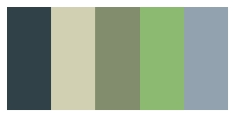
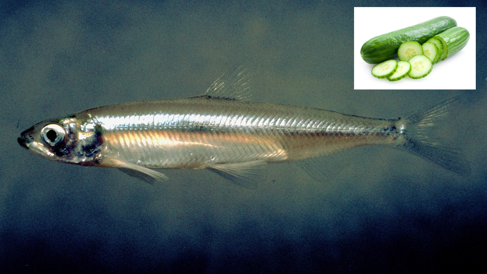

# sfecol - Colors of the San Francisco Estuary
***
The San Francisco Estuary is a complex watershed and home to many different species of wildlife. This `R` package uses images of the landscape and wildlife to create color palletes. Colors are extracted from images using https://colordesigner.io/color-palette-from-image and the package follows the excellent work of the [`Manu`](https://g-thomson.github.io/Manu) and [`wesanderson`](https://github.com/karthik/wesanderson) packages.
 
## Installation
***
This package is hosted on Github and can install it using the `devtools` package:
``` r
# install.packages("devtools")
devtools::install_github("MalteWillmes/sfecol")
```

## Usage
***
The colour palettes are stored as a list named `sfe_palettes`. Thus you can see a list of the available palettes like so:
```r
library(sfecol)
names(sfe_palettes)
[1] "delsme" "chinook" "chinookcarc" "southbay" "baslu"   
```

A helper function `sfe_pal()` returns the desited colour palette as a vector: For example:
```r
sfe_pal("delsme")
[1] "#304247" "#D1D0B3" "#828D6D" "#8DBA71" "#92A2AF"
```
There is also a helper function called `print_pal()` which displays the palette in the graphics window.
```r
print_pal(sfe_pal("delsme"))
```


## Colour palettes
***
The data for the graphs shown below come from the California Department of Fish and Wildlife, California Central Valley Chinook Population Database Report (GrandTab 2020.05.22). This dataset includes returning Chinook Salmon from four different runs (spring, winter, fall, late-fall) to the Sacramento and San Joaquin watershed. Total return (escapement) estimates include both in-river and hatchery fish. 

### delsme - *Hypomesus transpacificus* - Delta Smelt
```r
c("#304247", "#D1D0B3", "#828D6D", "#8DBA71", "#92A2AF")
```

