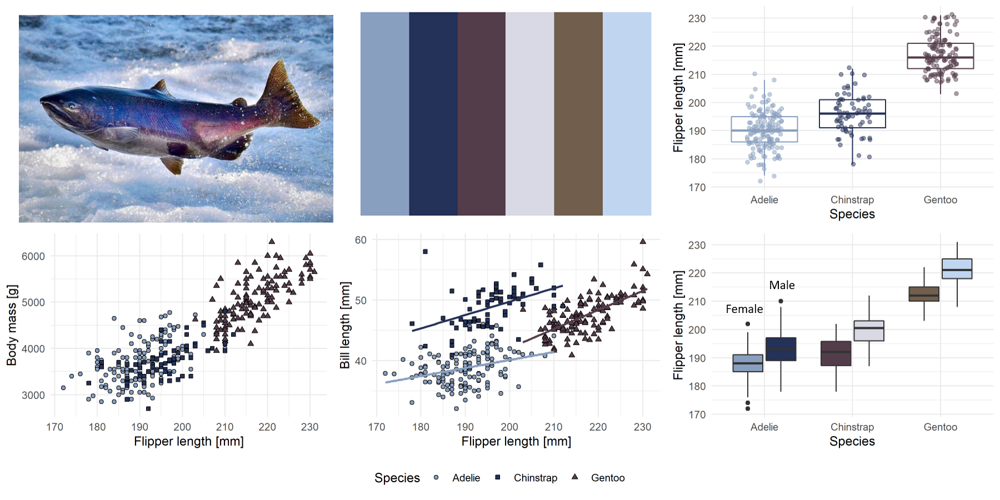
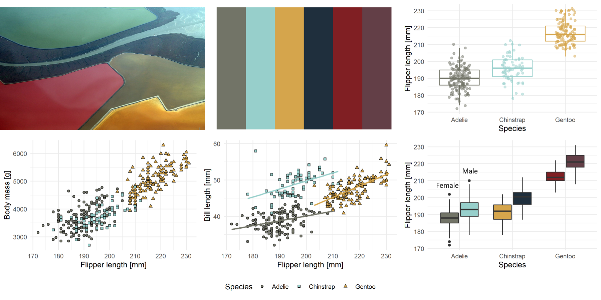

# sfecol - Colors of the San Francisco Estuary
***
The San Francisco Estuary is a complex watershed and home to many different species of wildlife. This `R` package uses images of the landscape and wildlife to create color palletes. Colors are extracted from images using https://colordesigner.io/color-palette-from-image and the package follows the excellent work of the [`Manu`](https://g-thomson.github.io/Manu) and [`wesanderson`](https://github.com/karthik/wesanderson) packages.
 
## Installation
***
This package is hosted on Github and can install it using the `devtools` package:
``` r
# install.packages("devtools")
devtools::install_github("MalteWillmes/sfecol")
```

## Usage
***
The colour palettes are stored as a list named `sfe_palettes`. Thus you can see a list of the available palettes like so:
```r
library(sfecol)
names(sfe_palettes)
[1] "delsme" "chinook" "chinookcarc" "southbay" "baslu"   
```

A helper function `sfe_pal()` returns the desited colour palette as a vector: For example:
```r
sfe_pal("delsme")
[1] "#304247" "#D1D0B3" "#828D6D" "#8DBA71" "#92A2AF"
```
There is also a helper function called `print_pal()` which displays the palette in the graphics window.
```r
print_pal(sfe_pal("delsme"))
```


## Colour palettes
***
The data for the graphs shown below come from the California Department of Fish and Wildlife, California Central Valley Chinook Population Database Report (GrandTab 2020.05.22). This dataset includes returning Chinook Salmon from four different runs (spring, winter, fall, late-fall) to the Sacramento and San Joaquin watershed. Total return (escapement) estimates include both in-river and hatchery fish. 

### delsme - *Hypomesus transpacificus* - Delta Smelt
```r
c("#304247", "#D1D0B3", "#828D6D", "#8DBA71", "#92A2AF")
```

Image: The Delta Smelt has a typical cucumber smell to it. Photo by Peterson, B. Moose, U.S. Fish and Wildlife Service.

### chinook - *Oncorhynchus tshawytscha* - Chinook Salmon
```r
c("#8AA0BF", "#243158", "#543D4A", "#D8D9E4", "#715E4D")
```

Image: A winter run Chinook Salmon in Battle Creek, CalTrout (https://caltrout.org/). Photo by Jane Work.

### chinookcarc - *Oncorhynchus tshawytscha* - Chinook Salmon carcass on Putah Creek
```r
c("#C8C3B5", "#2B2F2A", "#837C32", "#727877", "#634933")
```

Image: A Chinook Salmon carcass on Putah Creek. Photo by Ken Davis.

### southbay  - Soutbay Salt Ponds
```r
c("#727467", "#97CFCB", "#D5A54C", "#1F2F3D", "#801F23"),
```

Image: Bird's-eye view of the multi-colored salt ponds, Photo by Doc Searls from Santa Barbara, USA. 

### baslu - *Ariolimax columbianus* - Banana slug
```r
c("#6D7126", "#D0C56E", "#122006", "#AEB953", "#9B9899")
```

Image: A banana slug. Photo by Ben Stanfield.
