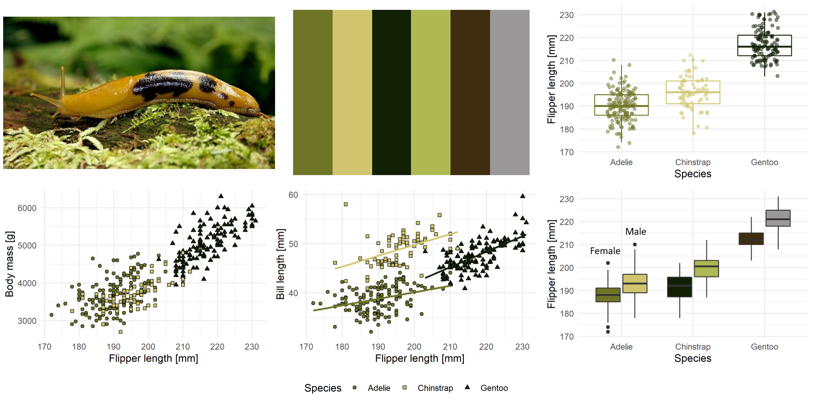

# sfecol - Colors of the San Francisco Estuary
***
The San Francisco Estuary is a complex watershed and home to many different species of wildlife. This `R` package uses images of the landscape and wildlife to create color palettes. Colors are extracted from images using https://colordesigner.io/color-palette-from-image and the package follows the excellent work of the [`Manu`](https://g-thomson.github.io/Manu) and [`wesanderson`](https://github.com/karthik/wesanderson) packages.
 
## Installation
***
This package is hosted on Github and can install it using the `devtools` package:
``` r
# install.packages("devtools")
devtools::install_github("MalteWillmes/sfecol")
```

## Usage
***
The colour palettes are stored as a list named `sfe_palettes`. Thus you can see a list of the available palettes like so:
```r
library(sfecol)
names(sfe_palettes)
[1] "delsme" "chinook" "chinookcarc" "southbay" "baslu"   
```

A helper function `sfe_pal()` returns the desited colour palette as a vector: For example:
```r
sfe_pal("delsme")
[1] "#304247" "#D1D0B3" "#828D6D" "#8DBA71" "#92A2AF" "#447484"
```
There is also a helper function called `print_pal()` which displays the palette in the graphics window.
```r
print_pal(sfe_pal("delsme"))
```


Since the `get_pal()` function returns the colour palettes as a character vector they can easily be used in the graphics package of your choice. Here are examples in both base `R` and [`ggplot2`](https://ggplot2.tidyverse.org/).
```r
# Base R implementation
plot(mtcars$disp, mtcars$hp, col = sfe_pal("delsme")[factor(mtcars$carb)], pch = 19, cex = 3 )

# ggplot2 implementation
library(ggplot2)
ggplot(mtcars, aes(disp, hp, colour = factor(carb))) +
   geom_point(size = 3) +
   scale_colour_manual(values = sfe_pal("delsme"))
```

## Colour palettes
***
The data for the graphs shown below comes from the Palmerpenguins dataset. This dataset contains various measurments of 344 penguins from 3 different species of penguins, collected from 3 islands in the Palmer Archipelago, Antarctica. 

Horst AM, Hill AP, Gorman KB (2020). palmerpenguins: Palmer Archipelago (Antarctica) penguin data. R package version 0.1.0. https://allisonhorst.github.io/palmerpenguins/. doi: 10.5281/zenodo.3960218.

### delsme - *Hypomesus transpacificus* - Delta Smelt
```r
c("#304247", "#D1D0B3", "#828D6D", "#8DBA71", "#92A2AF","#447484")
```

Image: The Delta Smelt has a typical cucumber smell to it. Photo by Peterson, B. Moose, U.S. Fish and Wildlife Service.

### chinook - *Oncorhynchus tshawytscha* - Chinook Salmon
```r
c("#899FBF", "#243158", "#543D4A", "#D8D9E4", "#715E4D", "#C0D5F0")
```

Image: A winter run Chinook Salmon in Battle Creek, CalTrout (https://caltrout.org/). Photo by Jane Work.

### chinookcarc - *Oncorhynchus tshawytscha* - Chinook Salmon carcass on Putah Creek
```r
c("#CDC9C0", "#2B2F2A", "#837C32", "#727877", "#634933", "#A89C6B")
```

Image: A Chinook Salmon carcass on Putah Creek. Photo by Ken Davis.

### southbay  - Soutbay Salt Ponds
```r
c("#727467", "#97CFCB", "#D5A54C", "#1F2F3D", "#801F23", "#633F47")
```

Image: Bird's-eye view of the multi-colored salt ponds, Photo by Doc Searls from Santa Barbara, USA. 

### baslu - *Ariolimax columbianus* - Banana slug
```r
c("#6F7527", "#D0C56E", "#122006", "#AEB953","#3F2D0F","#9B9899")
```

Image: A banana slug. Photo by Ben Stanfield.
